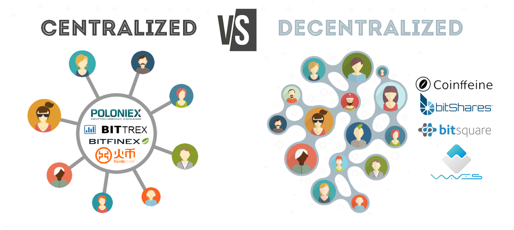

# Non-Exchange Platforms for Exchanging Cryptocurrency
In the early days of Cryptocurrency, the primary method of buying and selling Cryptocurrency was to find someone willing to make an in-kind or cash transaction on some type of platform made for that purpose. Few centralized Cryptocurrency exchanges existed, and those that did largely failed to legally serve the US market. Decentralized exchanges were not possible as smart contracts were not really commonplace until Ethereum came out a few years later. These platforms that came up included websites such as Reddit, where users could garner a reputation for being a trustworthy counterparty for exchanging Cryptocurrency, and easily make posts to find such counterparties. There were issues with this: scamming was rampant. Some individuals even attempted to perform these trades over Craigslist or similar general purpose marketplaces, which had no reliable reputation system.

# Centralized Exchanges
The first Cryptocurrency exchange was BitcoinMarket, founded in 2010, 14 months after the release of the Bitcoin network. Mt. Gox was founded shortly after, and was later mired in controversy after they lost users' balances. Coinbase, one of the most well-known exchanges today, was founded in 2012.

Mt. Gox is incredibly significant within Blockchain's history: when it lost many users' money in 2014, roughly $500 million, it dealt a substantial blow to the reputation and trust of centralized exchanges within the Blockchain community, and arguably slowed adoption of the technology. Mt. Gox also highlights the importance of computer security where Blockchain is involved, particularly when large values of Cryptocurrency are involved

&nbsp;

(Source: https://bisq.network)

&nbsp;

# Decentralized Exchanges
<Resources title="Suggested Reading" text="Decentralized exchanges arose largely to provide additional anonymity and prevent regulation. Decentralized exchanges are implemented by a smart contract which effectively maintains order books and matches buy orders with sell orders, similar to traditional stock market systems. By existing on the Blockchain in the form of a smart contract, the exchange is effectively decentralized, hich makes it difficult (if not impossible) to take down. These exchanges will fill orders to any member of the network, without verifying identity or enforcing any form of KYC process." resources={[ {link: "https://0x.org/pdfs/0x_white_paper.pdf", text: "0x Whitepaper. One of the most well known Decentralized Exchange protocols."} ]} />

*Definition*: "**Know Your Customer** is a standard in the investment industry that ensures investment advisors know detailed information about their clients' risk tolerance, investment knowledge, and financial position."
Source: [Investopedia](https://www.investopedia.com/terms/k/knowyourclient.asp)

For many decentralized exchanges to work with speed and efficiency, they match buy orders with sell orders to ensure that transactions are valid and will go through. The following diagram will give you an example of how this works.

<OrderBook />

# Automated Market Makers
We wanted to provide a special note about "Automated Market Makers" such as Bancor, and about exchanges in general that are implemented with the use of smart contracts, that are not fully decentralized.

<Resources title="Suggested Reading" text="Many of these systems are particularly susceptible to security vulnerabilities that could result in lost funds. Bancor has lost user assets a number of times, and the centralization of certain aspects (including updates) of the system increase the risk that they will lose user funds." resources={[ {link: "https://medium.com/@jamesgan/how-i-found-a-25m-vulnerability-in-blockchain-c2717d531dd8", text: "How I Found a $25m Vulnerability in Blockchain, James Gan"} ]} />

# Legal Challenges: Regulation and Compliance Without Guidelines
<Resources title="Suggested Reading" text="Regulation is a constant problem for Cryptocurrency exchanges. Rules are interpreted in numerous ways with often limited legal definitions around how to classify Cryptocurrency. In the United States, the SEC does not have clear guidelines for trading Cryptocurrency. To-date, the SEC has often indicated that they will treat Cryptocurrencies as securities, based on their rulings around “Initial Coin Offering” fundraising. Exchanges are, therefore, at a similar risk of unexpected regulatory and compliance complications." resources={[ {link: "https://papers.ssrn.com/sol3/papers.cfm?abstract_id=2867344", text: "Overview of Emerging Blockchain Architectures and Platforms for Electronic Trading Exchanges"} ]} />

<Resources title="Suggested Reading" text="In an article for Drexel Law Review, O’Connor argues that future regulation could be determined on whether or not the seller of a Cryptocurrency makes promises about the token. Promises of “future development or price appreciation”, similar to the promises that most companies make during ICOs, could cause the SEC to consider Cryptocurrencies to be securities. The flip side to this, for Cryptocurrencies that are promised as-is (no explicit, centralized improvement plan) to function primarily as digital currencies (e.g. Bitcoin), O’Connor suggests that they are less likely to be classified as securities." resources={[ {link: "https://heinonline.org/HOL/LandingPage?handle=hein.journals/drexel11&div=15&id=&page=", text: "Overreaching its Mandate, Michael O’Connor. Analysis of the history of rulings related to Cryptocurrency in the United States. This offers interesting legal insight into the regulatory future for Cryptocurrency exchanges."} ]} />

<Resources title="Suggested Reading" text="The DAO (Distributed Autonomous Organization, target of a historical multi-million dollar hack) token brought about the first significant action by the SEC on Cryptocurrency, and they classified as securities and the SEC ruled that exchanges trading them were not abiding by securities regulation. Damages and fines were not pursued, but this introduces possible issues of supporting certain Cryptocurrencies. The ruling abstracted out possible regulation to include Cryptocurrencies that promise future development - which is many of them (and practically every ICO Cryptocurrency). O'Connor notes that most Cryptocurrencies do not actually include any “investment contract” functionality, which should put them outside the purview of SEC authority. Ultimately, however, there is immense regulatory risk for Cryptocurrency exchanges* because there are not enough solidified, codified policies for how to classify and regulate Cryptocurrency." resources={[
 {link: "https://search.proquest.com/openview/aa958faf2291e757c2b7ea6a4f3f8212/1?pq-origsite=gscholar&cbl=36341", text: "Cryptocurrency exchanges avoiding the US due to confusing regulation, Jackson, Olly. International Financial Law Review"} ]} />

Lastly, we are left with a significant question: Do modern security regulations offer a feasible model for an asset distributed globally, amongst millions of stakeholders? If so, how would we define many traditional terms within existing regulation? O'Connor highlights the question of how to define “agents”, traditionally actors of a certain company or members listed on traditional assets. Would this term include open source developers? Forks? Overall, a poor definition could result in liability to Cryptocurrency exchanges just from people engaging with the Blockchain network which is typically, by definition, open.
