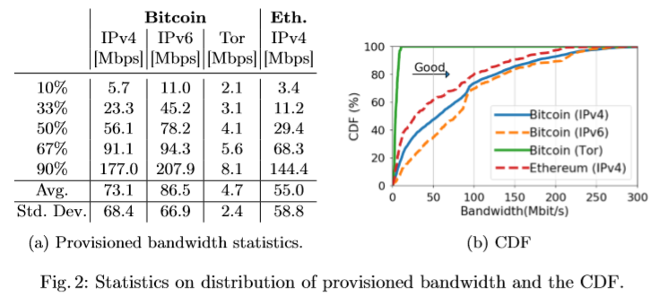

# Opening Quote
<Resources title="Quote" text="Cryptocurrencies, based on and led by Bitcoin, have shown promise as infrastructure for pseudonymous on-line payments, cheap remittance, trustless digital as-set exchange, and smart contracts.  However, Bitcoin-derived blockchain protocols have inherent scalability limits that trade off between throughput and latency, which withhold the realization of this potential." resources={[ {text: "“Bitcoin-NG”, presented at 13th USENIX Symposium, Eyal et al. (Cornell University)", link: "https://www.usenix.org/system/files/conference/nsdi16/nsdi16-paper-eyal.pdf"}]} />

# Scalability in Bitcoin
Bitcoin's original consensus protocol for maintaining a Blockchain leveraged proof-of-work, guarunteeing that all nodes accepted the longest chain with valid contents and a valid proof-of-work answer to a cryptopuzzle. This simple yet elegant solution brought a few key attributes: **trustlessness, decentralization, anonymity, and significant security from illegitimate transactions**. However, this came with certain limits: **Blockchain has a clear limit to its scalability**, being able to handle a miniscule fraction of the transactions that would take place in an average retail store.

Bitcoin originally targeted one block every 10 minutes, with a 1MB block size (how many transactions a single block can contain). This resulted in a throughput of roughly 5 transactions per second. In comparison, Visa processes around 1,700 transactions per second with capacity for tens of thousands per second. This highlights a shortcoming in Bitcoin: it can never substitute traditional financial systems without vastly improved scalability.

- **Throughput**: 5 *tx/sec*
- **Latency**: 640 *seconds*
- **Fee**: $0.50*/tx (as of 03/06/2020)*

<BlockSpeed />

# Block Size/Block Creation Rate Debate
Over the past few years there has been a massive debate around proposals to change the Bitcoin block size or block creation rates. We will avoid taking a position on this issue, but we want to highlight the factors at play.
- As block size or block creation rate increase, the memory and storage requirement to participate in the network increase.
- As block size or block creation rate increase, it takes longer for edge nodes in the network to receive updates. This poses a number of problems:
 - The Bitcoin network, and more other Blockchains, are traditionally centralized between the United States and China. This means that nodes in those geolocations will be able to access new blocks quicker.
 - Participation in proof-of-work requires large amounts of capital to see consistent returns, this amount of capital is centralized in richer countries, such as the United States and China.
 - The United States and China tend to have faster internet speeds than many other geolocations. This, amplified with the aforementioned problems, means that nodes outside of these areas are at a disadvantage while mining, disincentivizing network participation from these areas.
  - This makes Blockchains susceptible to impact from regulation and censorship from these two countries alone.
  - This lowers overall network participation, making majority (or other notable percentages) of network participation easier to achieve, increasing the possibility of selfish mining, 51% attacks, and other security vulnerabilities
As a result, there is a constant trade-off within the design of Bitcoin that requires optimizing between network participation and decentralization qualities.

In particular, this means that it is critical to consider the network speeds and technological capital available to potential members of the network across the world.

# Scalability Trade-offs
**Throughput vs Latency**: many of a blockchain’s benefits relate to having an immutable, trustless record of data. However, that record of data can only be trustless if you adhere to certain standards. For Bitcoin, those standards amount to the proof-of-work protocol and a blockchain that is open to the public. As throughput increases, you begin to limit the network’s ability to be open to the public, introducing new requirements to participation (being able to stay in sync with large, regular data updates that are primarily coming from the US or China - latency). By increasing latency, you begin to exclude smaller and more remote nodes from the network, thereby decreasing the trustless security guarantees that we could originally assume.

**Public vs private**: This trade-off between throughput and latency is a sort of fundamental truth within blockchain, but that is not to say that there are not ways to ensure both. In a public blockchain, there has been an emphasis around using blockchain’s benefits in a very strong form - allow anyone to work with data, smart contracts, and cryptocurrency.

On the other hand, private, or permissioned blockchains in particular tend to circumvent this issue by allowing many trusted actors to participate in the network, and typically trying to practice good regulatory compliance. This approach allows you to place requirements on the member nodes of your network, **which can significantly reduce decentralization, public usability, or trustless nature of the system**, but *can* introduce similar benefits within the network that you establish.

For example, Ripple has one of the largest market caps, and has a permissioned network setup in which a few nodes run as “validator nodes”, which are more trusted and run the blockchain (add new blocks), while “stock servers” observe new blocks and help keep track of the blockchain. This allows them to ensure that the nodes which need to stay up-to-date with the blockchain can have certain requirements (namely bandwidth, geolocation, and being a trusted actor), enabling those nodes to process larger amounts of data (increase in throughput).

# Measuring scalability
In "Decentralization in Bitcoin and Ethereum Networks" Gencer et al. perform a measurement study to determine the level of decentralization of Bitcoin and Ethereum. In the figure below, we can see how they were able to use globally distributed computers to measure percentiles of bandwidth within Bitcoin and Ethereum.

In other words, the slowest 10% of the Bitcoin network had under ~10Mbps bandwidth: requiring Bitcoin nodes to process above that much bandwidth would begin to push that 10% out of being able to participate freely in the network. This demonstrates the potential issues with increasing the Block size or frequency, and similar issues exist with many scalability solutions.

&nbsp;

(Source: Gencer et al., 2017)

&nbsp;

This process of measurement is quite valuable: repeating some similar form of measurement or analysis for any Blockchain solution that claims to increase scalability is critical to understanding what trade-offs are being made to obtain increased scalability. Alternatively, this sort of measurement can verify the efficacy of innovations that might achieve scalability with fewer, or less significant, trade-offs.

<Resources title="Suggested Reading" text="We strongly recommend reading the Gencer et al. paper. It goes into detail around various metrics of Blockchain networks to determine their decentralization, as well as related academic research in the field about mining power centralization within pools, resource requirements for participation, and more." resources={[ { link: "https://arxiv.org/abs/1801.03998", text: "“Decentralization in Bitcoin and Ethereum Networks”, Gencer et al. (Cornell University)" } ]} />

### There are MANY trade-offs in Blockchain

<Resources title="Note from James" text="One key thing we want to emphasize here is that many things in blockchain are trade-offs. These trade-offs exist throughout the field, and they are also one of the best ways to assess and evaluate new blockchain projects that you may discover. Bitcoin, Ethereum, and any other system that you have read the whitepaper for and have a strong understanding of are generally good reference points to use for those comparisons." resources={[ {text:"Whenever I read a new white-paper or listen to a new blockchain idea, I try to evaluate what technical, theoretical, and trust trade-offs are being made to enable whatever benefits are claimed."} ]} />

# Scalability: Potential Solutions
In the following sections, we highlight 3 technical methods that increase the scalability of Blockchain networks. Each solution has various trade-offs, and it is likely that none of them are complete solutions for scalability.

# Potential Solution 1: Sidechains
Sidechains independently handle transactions and regularly “settle up” with the main blockchain.

&nbsp;

(Source: TheBlockPro.com)

&nbsp;

As you see here, the “main blockchain” could be something like Bitcoin. Bitcoin has fairly high transaction costs, which can only transmit a limited amount of information. This does not scale to everyday transactions: a single high-traffic retailer such as Starbucks would quickly overwhelm the system. If you create a sidechain, however, you can interlink an independent system with higher throughput with the main network.

The lightning network, one of the most widely adopted sidechains, can actually enable high throughput on the Bitcoin network for everyday payments without an explicit partnership between two agents, relying on a chain of bi-directional payment channels within the network - in essence, it uses some extra cryptography to lump transactions together across many nodes, as pictured above. This allows for more complex paths to settle transactions off-chain.

Sidechains are an adjacent system to blockchain networks:
Processes transactions independently of original blockchain: higher scalability
“Settles up” regularly with the original blockchain: maintain guarantees from public blockchain
Uses the original blockchain’s cryptocurrency: wider adoption than a custom cryptocurrency, higher trust
Offer customization on powerful blockchains (e.g. Bitcoin) while maintaining other guarantees (e.g. auditability): fits well with corporate use cases
They also have other benefits:
if you have multiple sidechains with different implementations, one being hacked will not expose the entire system nor balances, only the funds that have been placed in that sidechain
Cryptography allows “IOU” system for transaction settlement with mitigated counterparty risk
If the main blockchain goes down, the sidechain can persist safely, but the sidechain can settle with the main blockchain regularly to maintain blockchain benefits

#### Sidechains Summary:

Sidechains are an adjacent system where:
- Transactions happen off-chain
- “Settles up” with chain
- Uses the original cryptocurrency
- Offer customization, maintain guarantees
Benefits:
- Contained vulnerabilities
- Mitigated counterparty risk
- Independent of main blockchain, leverages its benefits

#### Sidechains Pros & Cons

##### Pros
- Better liquidity, less volatility than new cryptocurrencies
- Highly scalable throughput
- Vulnerabilities only impact sidechain
- Can be customized (and partially centralized) without losing all main Blockchain guarantees

##### Cons
- (more) Susceptible to vulnerabilities
- May not have an open payment channel, requiring transactions to go through the network at a higher cost

Sidechains ultimately allow for highly scalable systems, which can be customized regardless of being on a public blockchain.

This means that you could implement a payment system sidechain on Bitcoin, with higher scalability, without making the system fully public, and without giving up the guarantees that you get from a public blockchain.

Vulnerabilities are more common than a reputable, secure public blockchain, but damage from vulnerabilities is limited to the sidechain. So, if you implement various blockchain products and features via sidechains, each one can be independent, with separate cryptocurrency balances to mitigate risk.

##### Sidechains offer:
1. Superior throughput compared to a normal blockchain;
1. Significantly less latency (because you are not waiting for blocks to process in between transactions, nodes just need transactions to propagate the sidechain), and;
1. Far lower fees (however, there is a larger fee, ~$4 when I checked, to set up a bidirectional payment channel on the Lightning network - other sidechains could bring this down.)

- **Throughput**: 1000*tx/sec*
- **Latency**: ~40 *seconds*
- **Fee**: $<0.05*/tx (as of 03/06/2020)*

<LightningvsBitcoin />

# Potential Solution 2: Bitcoin-NG
Bitcoin-NG is similar to a sidechain, but instead of being a layer on top of a blockchain, it actually allows for the same decentralized control that Bitcoin does, while allowing centralized processing of transactions by whichever node has mined the latest block.

Leader Election
- Proof-of-work
- Rewarded with tx fees:
 - 60% of last block,
 - 40% of leading block
Leader Work
- Set amount of time leading
- Process “microblocks”
- Lower resources required

Bitcoin-NG is the temporary quasi-centralization combined with microblocks with election via proof-of-work, which is the system described in the whitepaper where the quote from the start of the talk is from, which was co-created by an old professor of mine.

<Resources title="Resources" text="The leader election system is pretty similar: to become a leader, a node has to complete a proof-of-work puzzle. The leader is rewarded for solving the puzzle and leading. The leader earns 60% of the fees from the previous leader's blocks, and 40% of the fees from the blocks they publish. The mining reward structure is meant to incentivize honesty - the paper analyzes of what guarantees this provides - in essence, it allows more data to propagate, with stronger guarantees for network health" resources={[ {link: "https://www.usenix.org/system/files/conference/nsdi16/nsdi16-paper-eyal.pdf", text: "Bitcoin-NG"} ]} />

The leader doesn’t create one large block. Instead, they process and publish smaller blocks every 10 seconds until the next leader takes over. This allows for a combination of decentralized control of the network, with centralized transaction processing.

&nbsp;

(Source: Eyal & Sirer, 2015)

&nbsp;

At its core, the original Bitcoin-NG paper highlighted stronger guarantees around fairness, BFT, and mining power utilization, with equivalent throughput to Bitcoin. This allows a Blockchain network to increase the block size to achieve higher throughput while maintaining decentralization and reducing the risk of malicious control.

- **Throughput**: 100+ *tx/sec*
- **Latency**: 10-40 *seconds (depending on block size)*
- **Fee**: $less than Bitcoin*/tx (as of 03/06/2020)*&ast;

&ast;It is difficult to find an exact estimate - this system has not been well-adopted. It would be less than bitcoin simply due to the throughput, as it keeps a lot of other factors similar to Bitcoin.

# Potential Solution 3: Private/Permissioned Blockchains

**Ripple**:
- **Throughput**: 1500 *tx/sec*
- **Latency**: 7 *seconds*
- **Fee**: $0.0000024*/tx Fee (03/06/2020)*

The metrics for Ripple that are shown above are quite impressive: the best we’ve seen yet. However...

<Resources title="Significant Disclaimer:" text="This means that you can achieve high throughput, but only with a smaller group of trusted partners (e.g. a network of national banks, a limited network of international banks, a combination of tech companies, etc), which will inherently be less useful to public, individual users (and function more like a traditional product/service). Instead of comparing this with public Blockchains, it should really be compared with other inter-organization settlement options." resources={[ { text: "Private Blockchain networks do not maintain the same guarantees around decentralization and trustlessness that public Blockchains provide." } ]} />

###### Resources for learning / topics that need to be covered
- Sidechains https://www.blockstream.com/sidechains.pdf
- Lightning Network https://lightning.network/lightning-network-paper.pdf
- Bitcoin-NG https://www.usenix.org/system/files/conference/nsdi16/nsdi16-paper-eyal.pdf
- Ripple https://ripple.com/files/ripple_consensus_whitepaper.pdf
